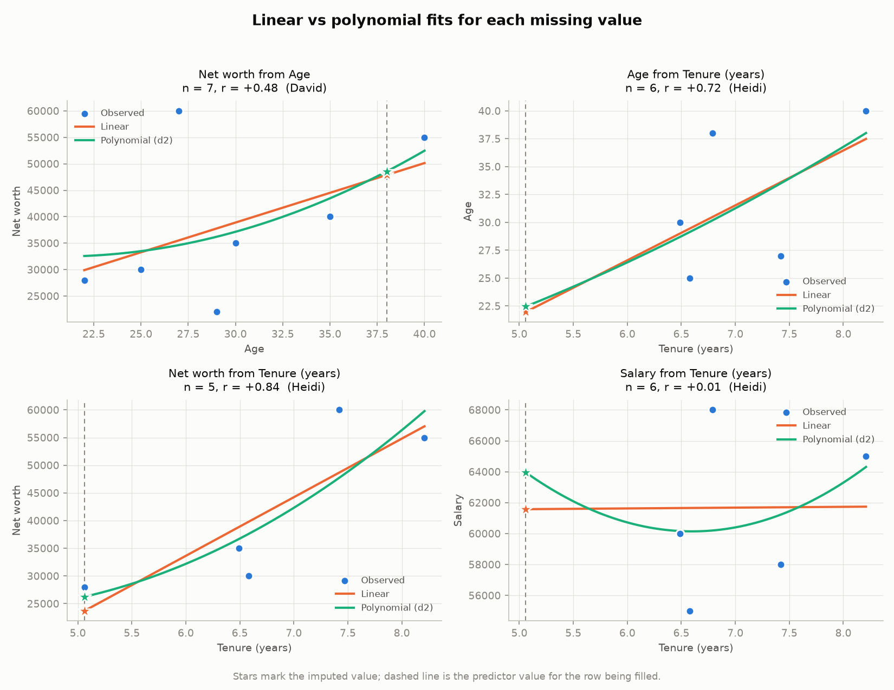
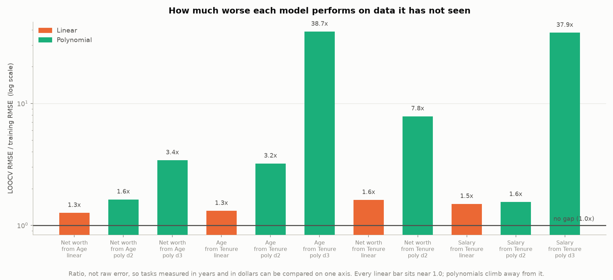

# Week 3 — Activity 2: Predicting Missing Values with Regression

Continues the cleaning pipeline from [Activity 1](../Activity1/README.md). Where
Activity 1 identified and left missing values as `NaN`, this activity estimates
them using two model families and compares which predicts better.

## Files

| File | Purpose |
|---|---|
| `data_preparation.py` | Activity 1's cleaning rules, extracted as importable functions |
| `regression_imputation.py` | The analysis: fits, cross-validation, imputation, figures |
| `imputation_results.txt` | Full program output |
| `figures/linear_vs_polynomial_fits.png` | Both fits plotted per imputation task |
| `figures/overfitting_gap.png` | How far each model's unseen-data error exceeds its training error |

Run with `python regression_imputation.py` (requires `scikit-learn`, `matplotlib`,
`pandas`, `numpy`). The dataset is located automatically in either this folder or
`Week3/`.

---

## The answer up front

**Linear regression predicts these missing values better.** It won 3 of the 4
imputation tasks under cross-validation, and its errors on unseen data were the
most stable of any model tested.

The result is worth stating carefully, because measured the way the sample code
measures it, the opposite conclusion appears:

| Criterion | Winner |
|---|---|
| Training R² / RMSE | **Polynomial degree 3 — won all 4 tasks** |
| Leave-one-out cross-validation RMSE | **Linear — won 3 of 4 tasks** |

Both rows are computed from the same fits on the same data. They disagree because
they answer different questions, and only one of them is the question imputation
actually asks.

---

## What was missing

After Activity 1's cleaning (10 raw rows → 9 unique people):

| Person | Missing | Available to predict from |
|---|---|---|
| David | Net worth | Age 38, Salary 68,000, Tenure 6.79 |
| Heidi | Age, Salary, **and** Net worth | Tenure 5.06 only |
| Charlie | Tenure | (join date blank in source) |
| Eve | Tenure | (join date `2019-13-01` — month 13, rejected) |

Heidi's row drives most of the difficulty: with three of four numeric fields
absent, every estimate for her must be squeezed out of a single predictor.

## Choosing predictors

A regression can only borrow information that a predictor actually carries, so
each gap was paired with the strongest correlate that is *present* for the row
being filled:

| Task | Predictor | r | Training pairs |
|---|---|---|---|
| David's Net worth | Age | +0.484 | 7 |
| Heidi's Age | Tenure | +0.717 | 6 |
| Heidi's Net worth | Tenure | +0.839 | 5 |
| Heidi's Salary | Tenure | **+0.011** | 6 |

That last row is not a mistake. Tenure carries essentially no information about
salary, and it is the only predictor Heidi has. The consequences are discussed
below — it turns out to be the most instructive case of the four.

---

## Method

Both models are built the same way, following the sample code's pattern:

```python
make_pipeline(PolynomialFeatures(degree=d, include_bias=False), LinearRegression())
```

Degree 1 *is* ordinary linear regression; degrees 2 and 3 are the non-linear
(polynomial) variants. Using one pipeline for both means the comparison isolates
the effect of curvature and nothing else.

Each fit is then scored twice:

**Training R² and RMSE** — how closely the curve retraces the very points it was
fitted to. This is what the sample code reports.

**Leave-one-out cross-validation (LOOCV) RMSE** — each row is hidden in turn, the
model is refitted on the remaining rows, and it predicts the hidden one. This
measures performance on data the model has never seen, which is precisely what
filling in a missing value requires.

A degree needing as many coefficients as it has training rows can pass through
them exactly, so those folds are refused rather than scored (this is why
`Net worth ← Tenure, degree 3` reports `n/a`: 5 rows, and LOOCV would leave 4 to
fit 4 coefficients).

---

## Results

### Task 1 — David's Net worth, from Age (n = 7, r = +0.484)

| Model | Train R² | Train RMSE | LOOCV RMSE |
|---|---|---|---|
| Linear | 0.235 | 11,473 | **14,497** |
| Polynomial d2 | 0.251 | 11,348 | 18,474 |
| Polynomial d3 | **0.352** | **10,555** | 36,022 |

Degree 3 fits the training points best and predicts unseen ones **2.5× worse**
than the straight line.

### Task 2 — Heidi's Age, from Tenure (n = 6, r = +0.717)

| Model | Train R² | Train RMSE | LOOCV RMSE |
|---|---|---|---|
| Linear | 0.514 | 4.6 | **6.0** |
| Polynomial d2 | 0.517 | 4.6 | 14.7 |
| Polynomial d3 | **0.600** | **4.2** | 161.6 |

The cubic's training RMSE improves by 9% while its cross-validated error grows
**27-fold**. Predicting an age to within ±162 years is not a prediction.

### Task 3 — Heidi's Net worth, from Tenure (n = 5, r = +0.839)

| Model | Train R² | Train RMSE | LOOCV RMSE |
|---|---|---|---|
| Linear | 0.703 | 7,230 | **11,657** |
| Polynomial d2 | 0.731 | 6,883 | 53,881 |
| Polynomial d3 | **0.963** | **2,555** | not computable |

The strongest correlation in the dataset, and also the smallest sample. Degree 3
reaches R² = 0.963 — it is nearly interpolating 5 points with 4 coefficients.
That number measures memorisation, not skill.

### Task 4 — Heidi's Salary, from Tenure (n = 6, r = +0.011)

| Model | Train R² | Train RMSE | LOOCV RMSE |
|---|---|---|---|
| Linear | **0.000** | 4,422 | 6,616 |
| Polynomial d2 | 0.163 | 4,045 | **6,279** |
| Polynomial d3 | 0.168 | **4,034** | 153,095 |

The one task the polynomial "wins", and it is a warning rather than an
endorsement. With r = +0.011 the linear fit is a **flat line** — its R² of exactly
0.000 means it has found nothing and is returning the mean salary. Regression
imputation has degenerated into mean imputation.

The degree-2 curve's 5% edge is not a discovered relationship; it is a parabola
draped over six scattered points, visible in the bottom-right panel of the fits
figure. Its apparent win is noise.



---

## The imputed values

| Row | Target | From | Linear | Poly d2 | Poly d3 |
|---|---|---|---|---|---|
| David | Net worth | Age | 47,885 | 48,555 | 43,952 |
| Heidi | Age | Tenure | 21.97 | 22.46 | 21.86 |
| Heidi | Net worth | Tenure | 23,691 | 26,245 | 28,049 |
| Heidi | Salary | Tenure | 61,579 | 63,956 | 63,864 |

The two approaches disagree by 1.4% to 10.8%. On this dataset the *disagreement*
is modest even though the *reliability* differs enormously — a reminder that two
imputations landing close together is not evidence that either is trustworthy.

Every value falls inside the observed range of its column, with one marginal
exception: Heidi's linear Age estimate of 21.97 sits 0.03 years below the observed
minimum of 22. Heidi and Grace share an identical tenure of 5.06 years, and Grace
is 22, so the line passes essentially through Grace's point.

---

## Why linear wins here



Every linear model sits at 1.3–1.6× its training error. Polynomials range from
1.6× to 38.7×.

**1. Sample size against parameter count.** Each model trains on 5–8 rows. A
degree-2 curve spends 3 coefficients; degree 3 spends 4. With 5 rows, a cubic has
almost as many knobs as observations and can thread through them exactly. The
usual guidance is roughly 10+ observations per coefficient — this dataset offers
between one and three.

**2. Training scores are structurally incapable of catching this.** R² on the
fitted points cannot fall when a term is added; it can only rise or stay flat.
Any comparison ranked by training R² will therefore recommend the most complex
model available, every time, regardless of whether that complexity is warranted.
This is why the sample code's evaluation — `r2_score(y, y_pred)` on the same `y`
used for fitting — cannot be used to *choose* between models, only to describe a
fit already chosen.

**3. Extrapolation behaviour.** Imputed rows sit near the edge of the observed
range (Heidi's tenure of 5.06 is the dataset minimum). A straight line leaving the
data's range stays plausible; a parabola or cubic accelerates away, and the
further out the prediction, the more violently they diverge.

**4. There is no curvature to find.** Age–income and tenure–wealth are close to
monotonic over these narrow ranges (Age 22–40, Tenure 5.1–8.2 years). The extra
polynomial terms have no genuine signal to model, so they fit noise instead.

## When polynomial regression *would* be the right choice

The sample code demonstrates exactly the conditions this dataset lacks:

| Condition | Sample code | This dataset |
|---|---|---|
| Sample size | 100 points | 5–8 rows |
| True relationship | Genuinely quadratic (`0.5x² + x + 2`) | Approximately linear |
| Predictor range | Wide, well-sampled | Narrow |
| Points per coefficient | ~33 | 1–3 |

Use polynomial regression when the relationship is visibly curved — diminishing
returns, saturation, growth then decline — **and** there are enough observations
per coefficient to distinguish that curve from noise. Choose the degree by
cross-validation, never by training R².

---

## Caveats on the imputed values themselves

Cross-validation identifies the *better* model here; it does not make the winner
*good*. The honest reading:

- Best-case LOOCV error is ±14,497 on a net worth that averages 38,571 — an error
  band of roughly 38%.
- Heidi's salary estimate carries no real information: her only predictor is
  uncorrelated with salary, so 61,579 is the sample mean in disguise. It should
  be recorded as *imputed by mean*, not as a regression result.
- Every imputed value should be flagged in any downstream analysis. Treating
  predictions as observations understates uncertainty and biases correlations
  toward the fitted relationship — the imputed points lie exactly on the line,
  which artificially strengthens the very association used to create them.
- With 9 rows, deleting incomplete cases would discard a third of the dataset,
  which is why imputation is worth attempting at all. That is a reason to impute
  carefully, not a reason to trust the output.
